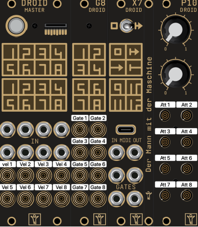

# droid_midi_drum_bridge

Droid patch to convert Midi to CV for drums with velocity

The patch listens to the midi channel 11 on the jack not on USB.

The table bellow shows where to which output the gate and velocity signals are routed to and which potentiometer attenuates the velocity signal.

| note # |  gate | velocity| Attenuator |
|--------|-------|---------|------------|
|   1    |  G1.1 |   O1    |   P1.3     |
|   2    |  G1.2 |   O2    |   P1.4     |
|   3    |  G1.3 |   O3    |   P1.5     |
|   4    |  G1.4 |   O4    |   P1.6     |
|   5    |  G1.5 |   O5    |   P1.7     |
|   6    |  G1.6 |   O6    |   P1.8     |
|   7    |  G1.7 |   O7    |   P1.9     |
|   8    |  G1.8 |   O8    |   P1.10    |
